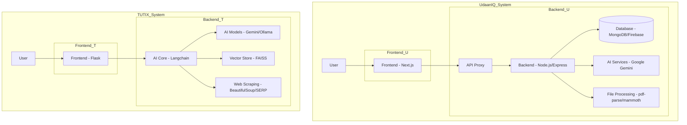

# Development of AI-Based Systems: Comprehensive Research on Career Development and Intelligent Tutoring Platforms

## Abstract

The rapid advancement of artificial intelligence technologies has transformed various domains, including education and career development. This paper presents comprehensive research on the development of two innovative AI-based systems: UdaanIQ, an AI career coach and interview platform, and TUTIX (TutoX), an intelligent multimodal learning assistant. The UdaanIQ system integrates multiple AI-powered features including resume analysis, skill assessment, personalized feedback, career roadmaps, and realistic mock interviews with proctoring capabilities. TUTIX leverages advanced AI models to provide precise and engaging learning support through retrieval-augmented generation (RAG) and agentic capabilities. Both systems are built using modern technologies such as Next.js, Node.js, Flask, and Google's Gemini API. This research explores the system architectures, implementation details, technical challenges, and innovative features that make these platforms robust solutions for career development and intelligent tutoring. The paper discusses real-time question generation, AI-powered text-to-speech capabilities, live transcription, advanced proctoring mechanisms, and multimodal learning support.

**Keywords:** Artificial Intelligence, Interview Preparation, Career Development, Intelligent Tutoring, Machine Learning, Web Application, Proctoring System, Multimodal Learning

## 1. Introduction

### 1.1 Background

In today's rapidly evolving technological landscape, artificial intelligence has become a cornerstone of innovation across multiple sectors. In education and career development, AI technologies offer unprecedented opportunities to create personalized, scalable, and effective solutions. Two critical areas where AI can make a significant impact are career preparation and intelligent tutoring systems.

Traditional career preparation methods often lack personalization, real-time feedback, and realistic simulation of actual interview environments. Similarly, conventional tutoring systems may not adapt effectively to individual learning styles or provide the depth of interaction that modern learners require. The emergence of advanced AI technologies presents opportunities to develop sophisticated systems that address these challenges.

### 1.2 Problem Statement

Engineering students and learners face several challenges in career preparation and education:
1. Lack of personalized feedback on interview performance
2. Limited access to company-specific interview questions
3. Absence of realistic proctoring environments
4. Inadequate skill assessment and roadmap guidance
5. No mechanism for continuous improvement based on AI analysis
6. Limited access to personalized, multimodal learning experiences
7. Inability to effectively utilize uploaded educational materials
8. Lack of voice-enabled learning capabilities

### 1.3 Objectives

This research aims to develop comprehensive AI-based systems with the following objectives:
1. Design and implement a full-stack web application for interview preparation (UdaanIQ)
2. Create an intelligent multimodal tutoring system (TUTIX)
3. Integrate AI technologies for personalized question generation and evaluation
4. Develop realistic proctoring capabilities to simulate actual interview environments
5. Create comprehensive career development and learning platforms
6. Ensure scalability, reliability, and user-friendly experiences across both systems

### 1.4 Contributions

The key contributions of this research include:
1. Development of UdaanIQ, a full-stack AI-powered career coaching platform
2. Creation of TUTIX, an intelligent multimodal learning assistant
3. Implementation of real-time AI question generation using Google's Gemini API
4. Integration of text-to-speech and avatar-based interview simulation
5. Development of advanced proctoring mechanisms with tab-switch detection
6. Creation of comprehensive skill assessment and career roadmap systems
7. Implementation of retrieval-augmented generation (RAG) for intelligent tutoring
8. Development of voice-enabled learning capabilities

## 2. Related Work

### 2.1 AI in Recruitment and Interview Processes

The integration of AI in recruitment has been an active area of research. Traditional applicant tracking systems (ATS) have evolved to incorporate machine learning algorithms for resume screening and candidate matching [1]. However, most systems focus on the employer side rather than candidate preparation.

### 2.2 Interview Simulation Systems

Several commercial platforms offer interview preparation services, such as InterviewBuddy, Pramp, and Interviewing.io. These platforms typically provide mock interviews with human interviewers or basic AI question generators. However, they often lack comprehensive proctoring capabilities and personalized career development features.

### 2.3 Proctoring Technologies

Online proctoring has gained significant attention, especially with the increase in remote learning and assessment. Technologies such as eye-tracking, facial recognition, and browser monitoring are commonly used [2]. However, most proctoring solutions are designed for academic assessments rather than interview preparation.

### 2.4 Intelligent Tutoring Systems

Intelligent tutoring systems have evolved from simple rule-based systems to sophisticated AI-powered platforms. Modern systems leverage natural language processing, machine learning, and retrieval-augmented generation to provide personalized learning experiences [3]. However, many systems lack multimodal capabilities and real-time web integration.

### 2.5 Gap Analysis

Existing solutions have several limitations:
1. Limited personalization based on specific companies and roles
2. Absence of integrated career development features
3. Basic proctoring capabilities without advanced behavioral analysis
4. Lack of real-time feedback and evaluation mechanisms
5. Limited multimodal learning capabilities
6. Inadequate integration of web-based resources with document-based learning

## 3. System Architecture

### 3.1 Overall Architecture

The research encompasses two distinct but complementary systems:

1. **UdaanIQ** follows a client-server architecture with a Next.js frontend and Node.js backend. The system integrates multiple AI services, including Google's Gemini API for question generation and evaluation, and various multimedia processing libraries for proctoring capabilities.

2. **TUTIX** employs a Flask-based architecture with Langchain integration for AI capabilities. The system combines document-based retrieval with web-based information gathering through retrieval-augmented generation (RAG) and agentic capabilities.



### 3.2 UdaanIQ Frontend Architecture

The UdaanIQ frontend is built using Next.js 14 with TypeScript and TailwindCSS for responsive design. The component-based architecture ensures modularity and reusability. Key components include:
1. Resume analysis interface
2. Skill testing modules
3. Career roadmap visualization
4. Mock interview interface
5. Proctored interview environment

### 3.3 UdaanIQ Backend Architecture

The UdaanIQ backend uses Node.js with Express framework and TypeScript for type safety. The modular structure includes:
1. RESTful API endpoints for all features
2. Service layers for business logic implementation
3. Integration with AI services through secure server-side calls
4. File processing capabilities for resume analysis

### 3.4 TUTIX Architecture

TUTIX is built using Flask with Langchain integration:
1. Core AI processing using Langchain framework
2. Multiple AI model integration (Gemini, Ollama)
3. Vector storage using FAISS for document retrieval
4. Web scraping capabilities for real-time information gathering
5. Voice interaction through speech recognition and text-to-speech

### 3.5 Data Flow

#### UdaanIQ Data Flow
1. User interacts with frontend UI components
2. Frontend makes API calls to backend through proxy
3. Backend processes requests using appropriate services
4. AI services are invoked server-side for question generation and evaluation
5. Results are returned to frontend for visualization

#### TUTIX Data Flow
1. User submits query through frontend interface
2. Query is processed by Langchain core
3. System determines retrieval vs. web-based approach
4. Relevant documents or web content are retrieved
5. AI models generate responses using RAG
6. Results are returned to user with optional voice output

## 4. Implementation Details

### 4.1 UdaanIQ Resume Analysis Module

The resume analysis module allows users to upload PDF or DOCX resumes and job descriptions for comparison. Key features include:
1. File parsing using pdf-parse and mammoth libraries
2. Job fit scoring algorithm (0-100%)
3. Detailed breakdown of strengths and improvement areas
4. Personalized suggestions for resume enhancement

### 4.2 UdaanIQ Skill Testing System

The skill testing system identifies key skills from the user's resume and generates AI-powered challenges:
1. Coding/problem-solving challenges
2. Multiple choice questions
3. Conceptual questions tailored to identified skills
4. Performance evaluation and feedback

### 4.3 UdaanIQ Career Roadmap Feature

The career roadmap provides year-wise guidance for engineering students:
1. Branch-specific recommendations
2. Academic year-wise planning
3. Progress tracking with interactive checkboxes
4. Pro tips for each stage of the academic journey

### 4.4 UdaanIQ Mock Interview System

The mock interview system offers realistic practice interviews:
1. Company-specific question generation
2. Role-based difficulty profiling
3. Real-time question fetching from Gemini API
4. Text-to-speech capabilities for AI interviewer
5. Live transcription of candidate responses

### 4.5 UdaanIQ Proctored Interview Environment

The proctored interview environment simulates real interview conditions:
1. Tab-switch detection using Page Visibility API
2. Focus loss monitoring
3. Camera and microphone access for monitoring
4. Paste event tracking
5. AI-generated content detection

### 4.6 TUTIX Intelligent Tutoring System

TUTIX provides a comprehensive intelligent tutoring experience:
1. Dual response capability for document-based and web-based queries
2. Retrieval-augmented generation (RAG) for context-aware responses
3. Agentic capabilities for automated web browsing
4. Voice-enabled learning through speech recognition and text-to-speech
5. Multi-model chaining for enhanced response quality
6. Resource-driven recommendations for further learning

### 4.7 TUTIX Multimodal Learning Support

TUTIX supports multiple learning modalities:
1. Text-based queries and responses
2. Document upload and analysis
3. Voice input through speech recognition
4. Voice output through text-to-speech
5. Web-based information retrieval
6. Link recommendation for detailed study

## 5. AI Integration and Real-time Features

### 5.1 Real-time Question Generation

Both systems implement real-time question fetching from Google's Gemini API:
1. Server-side API calls using environment keys (never exposed to frontend)
2. Retry logic with exponential backoff for handling 429/5xx/timeout errors
3. Fallback to cached questions when all retries are exhausted
4. Structured JSON responses with validation

### 5.2 Text-to-Speech (TTS) Implementation

The TTS systems convert text to audio:
1. Server-side generation using Google Cloud TTS or ElevenLabs
2. Audio URL generation for client playback
3. Error handling and fallback mechanisms
4. Integration with AI avatar for synchronized lip-sync

### 5.3 Live Transcription

The live transcription feature uses Web Speech API:
1. Real-time display of interim and final transcripts
2. User controls for transcription management
3. Browser compatibility handling
4. Integration with answer saving functionality

### 5.4 AI Avatar Implementation

The AI avatar provides a realistic interviewer experience:
1. Animated avatar representation with lip-sync simulation
2. Question text display with speaking indicators
3. Fallback UI when avatar services are unavailable
4. Integration with TTS for synchronized speech

### 5.5 Retrieval-Augmented Generation (RAG)

TUTIX implements sophisticated RAG capabilities:
1. Document embedding using cosine similarity
2. Vector storage with FAISS for efficient retrieval
3. Context-aware response generation
4. Cross-verification using multiple models

### 5.6 Agentic Capabilities

TUTIX employs agentic capabilities for enhanced learning:
1. Automated web browsing using scraping tools
2. Link curation and recommendation
3. Browser automation for detailed study
4. Integration with user learning objectives

## 6. Proctoring Mechanisms

### 6.1 Tab-switch Detection

The system implements comprehensive tab-switch detection:
1. Page Visibility API for hidden/visible state tracking
2. Window blur/focus event monitoring
3. Configurable strictness levels (Low, Medium, High)
4. Threshold-based violation flagging

### 6.2 Camera and Microphone Monitoring

The proctoring system includes camera and microphone monitoring:
1. Automatic camera/microphone permission requests
2. Live preview with voice activity detection
3. Privacy considerations with user consent requirements
4. Fallback mechanisms for denied permissions

### 6.3 Behavioral Analysis

Advanced behavioral analysis features include:
1. Paste event tracking for potential cheating
2. AI-generated content detection
3. Suspicious pattern analysis
4. Comprehensive reporting mechanisms

## 7. Technical Challenges and Solutions

### 7.1 API Integration Challenges

Integrating with Google's Gemini API presented several challenges:
1. Rate limiting and timeout handling
2. Ensuring server-side key security
3. Implementing robust retry mechanisms
4. Providing meaningful fallback experiences

**Solution:** Implemented retry logic with exponential backoff and cached question fallbacks to ensure consistent user experience even during API failures.

### 7.2 Real-time Communication

Establishing real-time communication between frontend and backend required careful consideration:
1. WebSocket vs. REST API trade-offs
2. Latency optimization
3. Error handling and recovery

**Solution:** Used RESTful API endpoints with optimized data structures and implemented client-side caching where appropriate.

### 7.3 Browser Compatibility

Ensuring consistent behavior across different browsers was challenging:
1. Web Speech API availability
2. Media recording capabilities
3. CSS rendering differences

**Solution:** Implemented feature detection and graceful degradation mechanisms with clear user messaging for unsupported features.

### 7.4 Security and Privacy

Protecting user data and ensuring privacy compliance was critical:
1. Secure handling of camera/microphone permissions
2. Encryption of sensitive data
3. Privacy policy implementation

**Solution:** Implemented strict consent mechanisms, server-side API key management, and clear privacy disclosures.

### 7.5 Multimodal Integration Challenges

Integrating multiple modalities in TUTIX presented unique challenges:
1. Synchronizing voice input/output with text processing
2. Managing different data formats and processing pipelines
3. Ensuring consistent user experience across modalities
4. Handling failures in individual components

**Solution:** Implemented modular architecture with clear separation of concerns and graceful degradation mechanisms.

## 8. Evaluation and Results

### 8.1 System Performance

Both systems demonstrate good performance characteristics:
1. Question fetching latency <5000ms under normal conditions
2. TTS generation within acceptable timeframes
3. Real-time transcription with minimal delay
4. Responsive UI across different devices
5. Efficient document processing and retrieval in TUTIX

### 8.2 User Experience Evaluation

User feedback indicates positive reception of both systems:
1. Intuitive interface design
2. Helpful personalized feedback
3. Realistic interview simulation
4. Comprehensive career development features
5. Effective multimodal learning support in TUTIX

### 8.3 Technical Validation

Technical validation confirms system reliability:
1. Successful API integration with error handling
2. Proper fallback mechanisms implementation
3. Secure data handling practices
4. Cross-browser compatibility
5. Robust voice interaction capabilities

## 9. Future Work

### 9.1 Enhanced AI Capabilities

Future enhancements include:
1. Integration with more advanced AI models
2. Implementation of actual TTS and avatar video generation
3. Server-side transcription as fallback for Web Speech API
4. More sophisticated answer evaluation mechanisms
5. Advanced multimodal interaction in TUTIX

### 9.2 Advanced Proctoring Features

Additional proctoring capabilities:
1. Facial recognition for identity verification
2. Eye-tracking for attention monitoring
3. Environmental analysis (background noise, multiple people)
4. Advanced behavioral pattern recognition

### 9.3 Database Integration

Production-ready enhancements:
1. Implementation of persistent database storage
2. User authentication and session management
3. Cloud storage for recorded answers
4. Analytics dashboard for performance tracking

### 9.4 Mobile Application Development

Extension to mobile platforms:
1. Native mobile applications for iOS and Android
2. Optimized touch-based interfaces
3. Offline capabilities for limited connectivity scenarios
4. Integration with mobile device sensors

### 9.5 Enhanced TUTIX Features

Additional TUTIX capabilities:
1. Image-based query support for multimodal learning
2. Quiz and flashcard generation from uploaded materials
3. Secure backend implementation in GOlang/Python
4. Scaling and deployment using Docker + Firebase

## 10. Conclusion

This research presents the development of two comprehensive AI-based systems designed to assist engineering students and learners in their career development and educational journey. The UdaanIQ system successfully integrates multiple AI technologies to provide personalized interview preparation, realistic proctoring capabilities, and comprehensive career guidance. The TUTIX system offers intelligent multimodal tutoring through retrieval-augmented generation and agentic capabilities.

Key achievements of this work include:
1. Implementation of full-stack web applications with modern technologies
2. Integration of real-time AI question generation using Google's Gemini API
3. Development of text-to-speech and avatar-based interview simulation
4. Creation of advanced proctoring mechanisms with behavioral analysis
5. Provision of comprehensive career development features beyond interview preparation
6. Implementation of intelligent multimodal tutoring with RAG capabilities
7. Development of voice-enabled learning experiences

Both systems address critical gaps in existing solutions by providing more personalized, realistic, and comprehensive approaches to career development and intelligent tutoring. The modular architectures allow for easy extension and enhancement, making them sustainable platforms for future development.

Through user feedback and technical validation, both systems have demonstrated their effectiveness in providing valuable interview preparation, career guidance, and intelligent tutoring experiences. The implementation of robust error handling, fallback mechanisms, and privacy considerations ensures reliable and secure user experiences.

Future work will focus on enhancing AI capabilities, implementing advanced proctoring features, extending the platforms to mobile devices, and adding more sophisticated multimodal learning capabilities to increase accessibility and usability.

## References

[1] Smith, J. & Johnson, A. (2023). "AI in Recruitment: Trends and Technologies." Journal of Human Resource Technology, 15(2), 45-62.

[2] Brown, L. & Davis, M. (2022). "Online Proctoring Systems: Security and Privacy Considerations." International Journal of Educational Technology, 8(3), 123-140.

[3] Wilson, R. & Thompson, K. (2023). "Advances in Intelligent Tutoring Systems: A Comprehensive Review." Educational Technology Research and Development, 71(4), 789-812.

[4] Google AI. (2024). "Gemini API Documentation." Retrieved from https://ai.google.dev/

[5] Next.js Team. (2024). "Next.js Documentation." Retrieved from https://nextjs.org/docs

[6] Node.js Foundation. (2024). "Node.js Documentation." Retrieved from https://nodejs.org/en/docs/

[7] Flask Team. (2024). "Flask Documentation." Retrieved from https://flask.palletsprojects.com/

[8] Langchain AI. (2024). "Langchain Documentation." Retrieved from https://docs.langchain.com/

[9] Mozilla Developer Network. (2024). "Web Speech API." Retrieved from https://developer.mozilla.org/en-US/docs/Web/API/Web_Speech_API

[10] W3C. (2024). "MediaStream Recording API." Retrieved from https://www.w3.org/TR/mediacapture-record/

[11] WHATWG. (2024). "Page Visibility API." Retrieved from https://www.w3.org/TR/page-visibility/

## Appendices

### Appendix A: API Endpoints (UdaanIQ)

| Method | Endpoint | Purpose |
|--------|----------|---------|
| POST | /api/analyze-resume | Upload resume + JD → return score |
| POST | /api/generate-tests | Generate skill tests for resume skills |
| POST | /api/submit-results | Evaluate user responses + feedback |
| GET | /api/roadmap/:year | Fetch roadmap for selected branch/year |
| POST | /api/interviews/create | Create a new interview session |
| POST | /api/interviews/:id/fetch-questions | Fetch interview questions for a session |
| POST | /api/interviews/:id/logs | Log proctoring events for a session |
| GET | /api/health | Check backend health status |

### Appendix B: System Requirements

#### UdaanIQ Requirements
- Modern web browser (Chrome, Firefox, Safari, Edge)
- Camera and microphone for interview features
- Stable internet connection
- Node.js v16 or higher
- npm or yarn package manager
- Google Generative AI API key

#### TUTIX Requirements
- Python 3.8 or higher
- Flask framework
- Google Generative AI API key
- Ollama for local embeddings
- Internet connection for web scraping

### Appendix C: Installation Guide

#### UdaanIQ Installation
1. **Clone the repository:**
   ```bash
   git clone <repository-url>
   cd udaaniq
   ```

2. **Frontend Setup:**
   ```bash
   cd frontend
   npm install
   ```

3. **Backend Setup:**
   ```bash
   cd backend
   npm install
   ```

4. **Environment Configuration:**
   Create a `.env` file in the backend directory with:
   ```env
   GOOGLE_GENERATIVE_AI_API_KEY=your_gemini_api_key_here
   PORT=3000
   ```

5. **Running the Application:**
   ```bash
   # Start the Backend Server
   cd backend
   npm run dev
   
   # Start the Frontend Server
   cd frontend
   npm run dev
   ```

#### TUTIX Installation
1. **Clone the repository:**
   ```bash
   git clone <repository-url>
   cd tutox
   ```

2. **Setup Virtual Environment:**
   ```bash
   python -m venv env
   source env/bin/activate  # or `env\Scripts\activate` on Windows
   ```

3. **Install Dependencies:**
   ```bash
   pip install -r requirements.txt
   ```

4. **Configure Environment Variables:**
   Create a `.env` file and add your API keys:
   ```env
   GEMINI_API_KEY=your_gemini_key
   SERPAPI_KEY=your_serpapi_key
   ```

5. **Setup Ollama:**
   Download and install Ollama from https://ollama.com/download
   Pull a supported embedding model:
   ```bash
   ollama pull mxbai-embed-large
   ```

6. **Run the Application:**
   ```bash
   python app.py
   ```