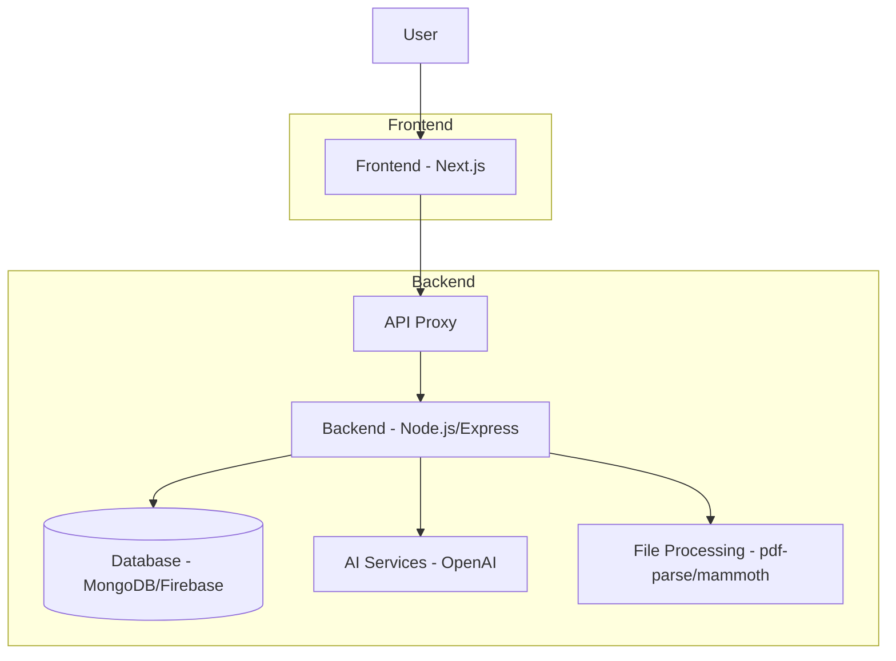

# UdaanIQ Architecture

## Component Overview

### Frontend (Next.js)
- Built with React and TypeScript
- Uses TailwindCSS for styling
- Responsive design for all devices
- Implements all core features:
  - Resume Analysis
  - Skill Testing
  - Career Roadmap
  - Feedback System

### Backend (Node.js/Express)
- RESTful API endpoints
- Resume parsing with pdf-parse and mammoth
- Integration with AI services
- Data processing and analysis

### Database
- (Not implemented in demo) Would use MongoDB or Firebase in production

### AI Services
- (Mocked in demo) Would integrate with OpenAI GPT in production

## Data Flow

1. User interacts with frontend UI
2. Frontend makes API calls to backend through proxy
3. Backend processes requests:
   - Parses resume files
   - Analyzes job descriptions
   - Generates skill tests
   - Retrieves roadmaps
4. Backend returns structured data to frontend
5. Frontend displays results with visualizations

## API Endpoints

| Method | Endpoint | Purpose |
|--------|----------|---------|
| POST | /api/analyze-resume | Upload resume + JD → return score |
| POST | /api/generate-tests | Generate skill tests for resume skills |
| POST | /api/submit-results | Evaluate user responses + feedback |
| GET | /api/roadmap/:year | Fetch roadmap for selected branch/year |